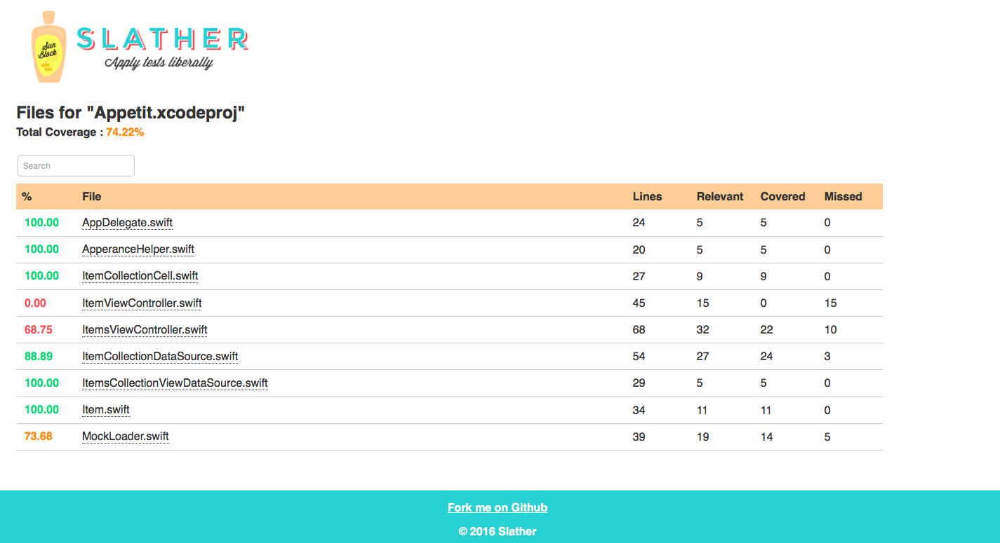

# Appetit

[](https://github.com/douglastaquary/appetit/blob/master/LICENSE)
[](https://travis-ci.org/douglastaquary/appetit)

-------
<p align="center">
    <a href="#Appetit Screens">Appetit Screens</a> &bull;
    <a href="#motivacao">Motivação</a> &bull;
    <a href="#ferramentas">Ferramentas de Testes</a> &bull;
    <a href="#cobertura">Cobertura de Testes</a> &bull;
    <a href="#instalacao">Instalação</a>
</p>
-------

## Appetit Screens

<h3 align="center">
  
</h3>

## Motivação

Esse repositório é referente ao protótipo criado para demonstrar o resultado do estudo e prova de conceito para as ferramentas de testes para iOS.

## Ferramentas de Testes

Esse projeto dois frameworks de Testes:

- [Quick](https://github.com/Quick/Quick) |  Behavior-drive development framework para swift e objective-C que vem junto com Nimble.

- [Nimble](https://github.com/Quick/Nimble) | Matcher framework

No Xcode 5, a Apple incluiu uma ferramenta de Testes chamada **XCTests**. Com ele você consegue gerar códigos de testes de UI, corbertura de código e escrever os testes unitários. Pra mim, que fique bem claro que é minha opinião, prefiro usar o `Quick`, pois o `XCTest` apesar de ajudar muito,tem uns gaps que deixa esse framework nativo em desvantagem quando comparado os outros dois escolhidos. Cito dois pontos bastantes relevantes: Fácil escrita/leitura e menos boilerplate de código.

## Instalação

Esse projeto usa [Bundler](http://bundler.io) e [Cocoapods](https://cocoapods.org). Tudo o que precisa ser feito é executar os seguintes comandos:
```
bundle
bundle exec pod install
```

## Testes 

Você pode rodar os testes a qualquer momento. Basta executar o comando: 
```
bundle exec fastlane test
```

## Cobertura de Testes

- [Slather](https://github.com/SlatherOrg/slather) |  Framework que gera relatórios com cobertura de código para projetos do Xcode.

<h3 align="center">
  
</h3>

## License
This project is licensed under the terms of the MIT license. See the LICENSE file.
